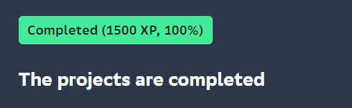

# SQL_Training

## Result

## Context

Day 1
  Today you will see how relational model works and how to get needed data based on basic constructions of SQL \
Day 2
  Today you will see how to get needed data based on sets constructions and simple JOINs \
Day 3
  Today you will see how to get needed data based on different structures JOINs \
Day 4
  Today you will see how to change data based on DML language \
Day 5
  Today you will see how to use a virtual view and physical snapshot of data
Day 6
  Today you will see how and when to create database indexes
Day 7
  Today you will see how to add a new business feature into our data model
Day 8
  Today you will see how to use specific OLAP constructions to get a “Value” from data
Day 9
  Today you will see how database works with transactions and isolation levels
Day 10
  Today you will see how to create and use functional blocks in Databases
Team 1
  Today you will implementing a quick solution on SQL to achieve results of Traveling Salesman Problem
Team 2
  Today you will know what DWH is and how to create a first ETL process
